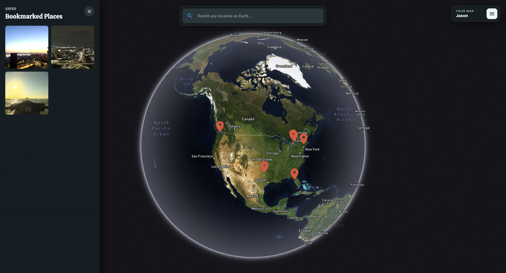

# GeoGallery v2.0

GeoGallery is a full-stack photo mapping application where users can upload
photos, pin them to real-world locations, and revisit their memories through an
interactive global map.

The project was originally developed as Globe Pin and combines a React
frontend with an Express API, Supabase authentication and data storage, Amazon
S3 image storage, Redis caching and rate limiting, and Mapbox mapping services.

<p align="center">


</p>

## Features

- Explore geotagged posts on an interactive global map
- Search for locations and move directly to them
- Upload photos with descriptions, dates, and coordinates
- Sign in with Google through Supabase Auth
- Filter the map to show only your posts
- Bookmark posts and browse saved places
- Cache reverse geocoding and signed image URLs with Redis
- Rate limit expensive geocoding and upload routes
- View and delete your own posts
- Switch between colorful light and satellite dark map themes
- Use your current location when creating a post
- Use the app on desktop and mobile layouts

## Technology

### Frontend

- React 19
- TypeScript
- Vite
- Mapbox GL and `react-map-gl`
- Material UI
- Google Places Autocomplete

### Backend

- Node.js
- Express
- TypeScript
- Multer for image uploads
- AWS SDK for S3
- Redis for backend caching
- `express-rate-limit` and Redis-backed request limits
- Vitest and Supertest for backend route tests

### Services

- Supabase Auth and Postgres
- Amazon S3
- Redis / Render Key Value
- Mapbox
- Google Maps Platform
- Vercel for the frontend
- Render for the backend
- GitHub Actions for CI

## Architecture

```text
Browser
  |
  |-- React frontend ---------------- Supabase Auth
  |
  `-- Express API
        |-- Supabase Postgres
        |-- Amazon S3
        |-- Redis cache / rate limit store
        `-- Mapbox Geocoding API
```

When a user creates a post, the frontend sends the photo and post details to
the Express API. The API uploads the image to S3 and stores its object key with
the post data in Supabase. When posts are requested, the API generates signed
S3 URLs and returns them to the frontend. Signed S3 URLs are cached in Redis so
repeated post fetches can reuse valid access URLs instead of regenerating them
for every image.

Reverse geocoding requests are cached with Redis. When the frontend asks for a
readable address from latitude and longitude coordinates, the API first checks
Redis using a rounded coordinate cache key. Cache hits return immediately from
Redis, while cache misses call the Mapbox Geocoding API, store the result in
Redis with a TTL, and then return it to the frontend.

Redis is also used as the shared store for API rate limiting. This protects
high-cost routes such as reverse geocoding and image uploads from repeated
bursts of traffic before they reach Mapbox, S3, or the database.

## Project Structure

```text
Globe-Pin/
|-- .github/workflows/ci.yml   # Frontend and backend CI checks
|-- backend/
|   |-- src/
|   |   |-- __tests__/         # Backend route tests
|   |   |-- middleware/        # Express middleware such as rate limiting
|   |   |-- routes/            # Posts, bookmarks, and geocoding routes
|   |   |-- scripts/           # Data migration utilities
|   |   |-- app.ts             # Express application
|   |   |-- db.ts              # Supabase server client
|   |   |-- redis.ts           # Redis client
|   |   `-- s3.ts              # Amazon S3 client
|   |-- Dockerfile
|   `-- package.json
|-- src/                       # React frontend
|-- Dockerfile                 # Frontend production image
|-- docker-compose.yml
|-- package.json
`-- README.md
```

## Environment Variables

Create a `.env` file in the project root:

```env
VITE_API_URL=http://localhost:3001
VITE_SUPABASE_URL=your_supabase_project_url
VITE_SUPABASE_KEY=your_supabase_anon_key
VITE_MAPBOX_TOKEN=your_mapbox_public_token
VITE_GOOGLE_MAPS_API_KEY=your_google_maps_api_key
```

Create a second file at `backend/.env`:

```env
VITE_SUPABASE_URL=your_supabase_project_url
VITE_SUPABASEROLE_KEY=your_supabase_service_role_key
VITE_MAPBOX_TOKEN=your_mapbox_token
AWS_ACCESS_KEY_ID=your_aws_access_key_id
AWS_SECRET_ACCESS_KEY=your_aws_secret_access_key
AWS_REGION=your_aws_region
AWS_S3_BUCKET=your_s3_bucket_name
REDIS_URL=redis://redis:6379
FRONTEND_URL=http://localhost:8080
```

Do not commit either `.env` file. The Supabase service-role key and AWS
credentials must only be used by the backend.

Use `REDIS_URL=redis://redis:6379` when the backend runs inside Docker Compose.
Use `REDIS_URL=redis://localhost:6379` when the backend runs locally with
`npm run dev --prefix backend` and only the Redis container is running in
Docker. In production on Render, use the internal URL from the Render Key Value
instance.

The backend must connect to Redis before the Express app imports routes that
create Redis-backed rate limiters.

## Run With Docker

Docker is the recommended way to run the complete application.

### Requirements

- Docker Desktop
- Supabase, AWS, Mapbox, and Google Maps credentials
- The two environment files described above

From the project root, build and start all services:

```bash
docker compose up --build
```

Open:

```text
Frontend: http://localhost:8080
Backend:  http://localhost:3001
Redis:    localhost:6379
```

The Docker images install their own npm dependencies, so a local
`node_modules` directory is not required for this setup.

Stop the containers with:

```bash
docker compose down
```

## Run Without Docker

Use this option for faster frontend development, editor tooling, linting, or
running each service independently.

### Requirements

- Node.js 20 or newer
- npm
- The two environment files described above

Install dependencies:

```bash
npm ci
npm ci --prefix backend
```

Start the backend:

```bash
npm run dev --prefix backend
```

In another terminal, start the frontend:

```bash
npm run dev
```

The frontend development server is available at `http://localhost:5173`. When
using this mode, set `FRONTEND_URL=http://localhost:5173` in `backend/.env`.
If Redis is running through Docker while the backend runs locally, set
`REDIS_URL=redis://localhost:6379`.

To run only Redis through Docker for local backend development:

```bash
docker compose up redis
```

## Available Commands

### Frontend

```bash
npm run dev       # Start the Vite development server
npm run build     # Type-check and create a production build
npm run lint      # Run ESLint
npm run preview   # Preview the production build
```

### Backend

```bash
npm run dev --prefix backend      # Start with automatic reload
npm run build --prefix backend    # Compile TypeScript
npm test --prefix backend         # Run backend route tests
npm run test:watch --prefix backend
npm start --prefix backend        # Run the compiled server
npm run migrate:s3 --prefix backend
```

## S3 Migration

The migration command copies legacy post images from Supabase Storage to S3
while preserving their object keys:

```bash
npm run migrate:s3 --prefix backend
```

The script:

- Reads image keys from the `posts` table
- Checks whether each image already exists in S3
- Downloads missing images from Supabase Storage
- Uploads them to the configured S3 bucket

## Redis Caching

Redis is used for backend caches that avoid repeated external service work.

### Reverse Geocoding

The `/geocode` route uses Redis to cache Mapbox reverse-geocoding responses.
The cache key is based on rounded coordinates:

```text
geocode:v1:<latitude>:<longitude>
```

Example:

```text
geocode:v1:40.71280:-74.00600
```

The first request for a coordinate pair is a cache miss, so the API calls
Mapbox and stores the address in Redis. Later requests for the same rounded
coordinates are cache hits, so the API returns the cached address without
calling Mapbox again.

This improves response time for frequently viewed posts, reduces repeated
external API calls, and lowers the chance of hitting Mapbox rate limits.

### S3 Signed URLs

The `/api/posts` route uses Redis to cache signed S3 URLs for post images.
Supabase stores the S3 object key for each post, and the backend turns that key
into a temporary signed URL that the frontend can use in image tags.

The cache key is based on the S3 object key:

```text
s3:signed-url:v1:<image-key>
```

Example:

```text
s3:signed-url:v1:user-id-1720000000000.jpg
```

On a cache miss, the API verifies the object exists in S3, generates a signed
URL, stores it in Redis, and returns it with the post data. On a cache hit, the
API returns the cached signed URL and skips the S3 object check and signing
work.

Signed URLs are generated with a seven-day expiration, while Redis stores them
for six days. The shorter Redis TTL prevents the API from returning a cached URL
after the S3 URL has expired. When a post is deleted, the API also removes that
image's cached signed URL from Redis.

## API Rate Limiting

The backend uses `express-rate-limit` with Redis as the shared store for
request counters. This keeps limits consistent if the backend runs multiple
instances and avoids relying on per-process memory.

Current protected routes:

- `/geocode`: limits repeated reverse-geocoding requests
- `POST /api/posts`: limits image upload attempts before Multer parses files

When a client exceeds a limit, the middleware returns:

```text
429 Too Many Requests
```

Rate limit headers are enabled so clients can inspect remaining quota and reset
timing. In production behind Render's proxy, Express should trust the proxy so
IP-based limiting uses the forwarded client IP instead of the proxy address.

